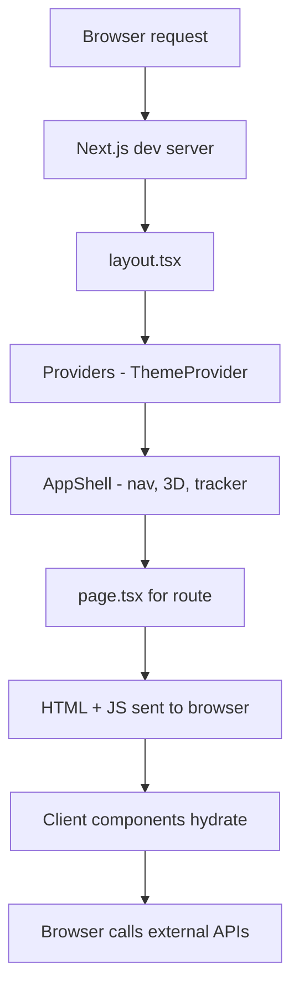
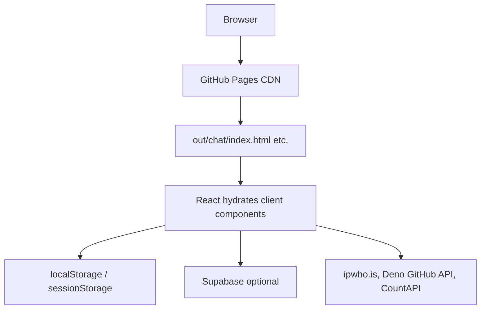
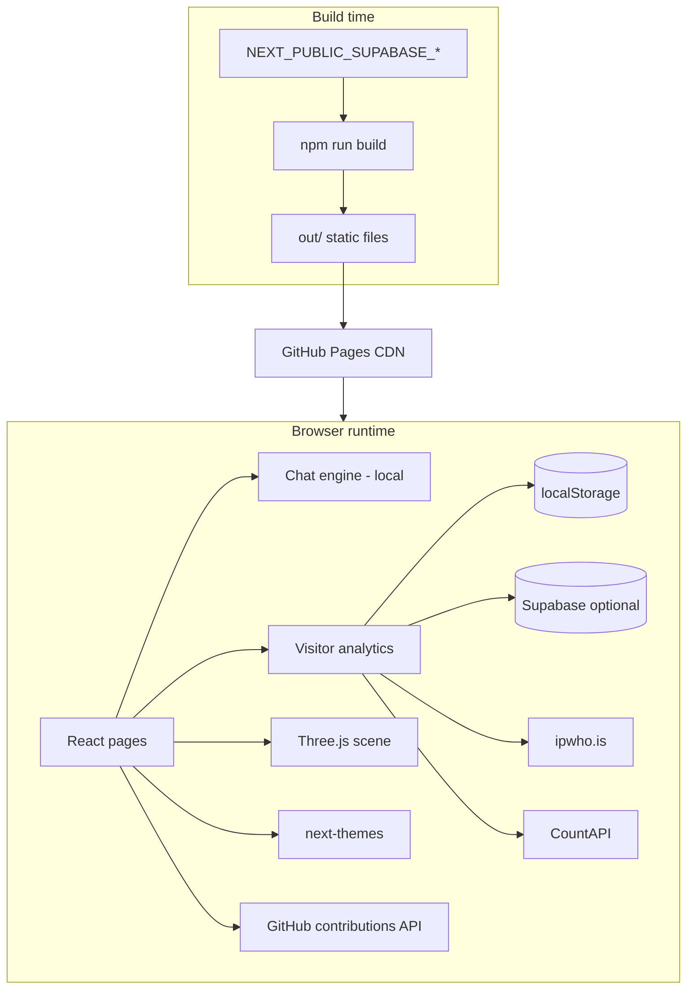
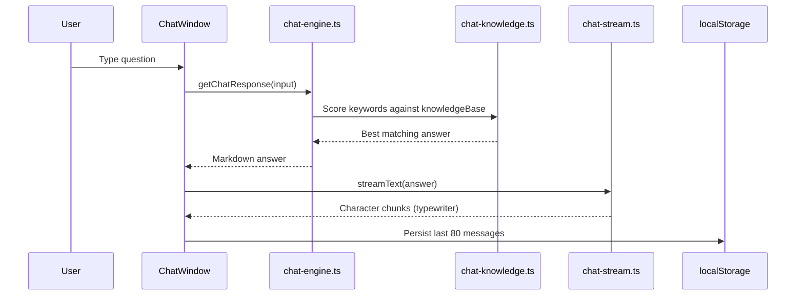
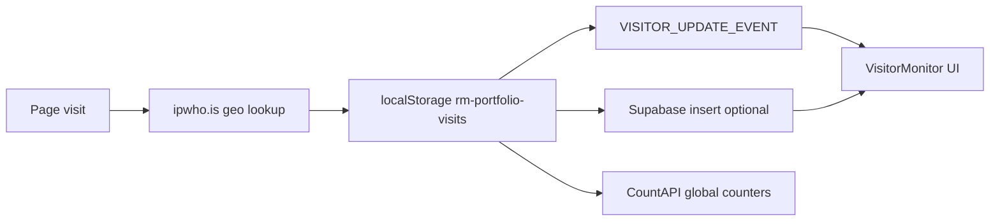
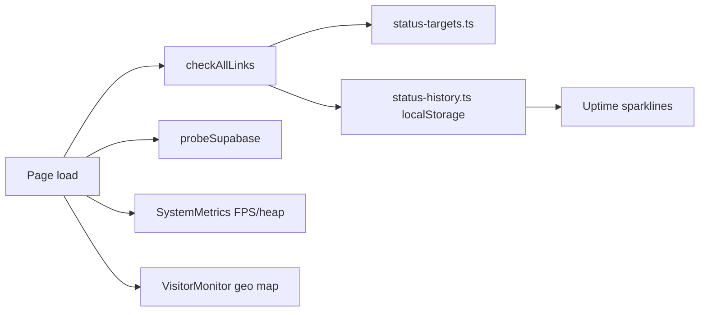

# Rihan Mohammed — Portfolio

**Live site:** [im-rihan.github.io](https://im-rihan.github.io)

A production-grade personal portfolio built with **Next.js 16**, **React 19**, and **static export** for GitHub Pages. It combines a single-page resume layout, interactive 3D background, client-side portfolio chat, live visitor analytics, and dedicated utility pages — all without a backend server in production.

---

## Table of contents

1. [Overview](#overview)
2. [Tech stack & dependencies](#tech-stack--dependencies)
3. [How Next.js works in this project](#how-nextjs-works-in-this-project)
4. [Project structure](#project-structure)
5. [Architecture](#architecture)
6. [Pages & features](#pages--features)
7. [Core modules explained](#core-modules-explained)
8. [Environment variables](#environment-variables)
9. [Scripts reference](#scripts-reference)
10. [Brand assets](#brand-assets)
11. [Local development](#local-development)
12. [Build & preview](#build--preview)
13. [Deployment (GitHub Pages)](#deployment-github-pages)
14. [Resume sync](#resume-sync)
15. [Legacy site](#legacy-site)

---

## Overview

This repository is the source for **Rihan Mohammed's** developer portfolio — a Full Stack Developer working on fintech and real-estate platforms at **HomeAbroad Inc.** and **Ziffy.ai**.

| Highlight | Detail |
|-----------|--------|
| **Experience** | 4+ years, 9+ production projects |
| **Focus** | React, Next.js, NestJS, TypeScript, AWS |
| **Deployment** | Static HTML on GitHub Pages (`gh-pages` branch) |
| **Runtime** | 100% client-side after build — no Node server in production |
| **Optional backend** | Supabase for cross-device visitor analytics |

### What makes this portfolio different

- **3D interactive background** — React Three Fiber globe scene that reacts to scroll, theme, and cursor (toggleable; respects reduced motion)
- **Case studies** — Six production write-ups at `/work/` with problem → approach → results
- **Portfolio chat** — FAQ assistant trained on resume data; runs entirely in the browser (no LLM API)
- **Contact form** — Themed dropdown + FormSubmit AJAX with mailto fallback
- **Live analytics dashboard** — visitor world map, browser telemetry, endpoint health with uptime history
- **Testimonials** — Endorsements section on the home page
- **Dark / light theme** — persisted via `next-themes`
- **Certifications showcase** — 14 certs with issuer filters and animations
- **SEO & social** — sitemap, robots.txt, JSON-LD, Open Graph images (dark + light), favicon, brand logos
- **Optional Plausible analytics** — privacy-friendly page views when `NEXT_PUBLIC_PLAUSIBLE_DOMAIN` is set

---

## Tech stack & dependencies

### Runtime dependencies

| Package | Version | Purpose in this project |
|---------|---------|-------------------------|
| **next** | ^16.2.9 | App framework — routing, metadata, static export, font optimization |
| **react** / **react-dom** | ^19.0.0 | UI rendering; all pages and components are React |
| **next-themes** | ^0.4.4 | Dark/light theme toggle; adds `.dark` / `.light` class on `<html>` |
| **framer-motion** | ^12.0.0 | Animations — navbar, overlays, certification cards, fade-ins |
| **lucide-react** | ^0.475.0 | Icon set used across navbar, chat, status, contact |
| **@react-three/fiber** | ^9.0.0 | React renderer for Three.js — powers the 3D background canvas |
| **@react-three/drei** | ^10.0.0 | R3F helpers — stars, sparkles, globe, grid, camera utilities |
| **three** | ^0.173.0 | WebGL 3D engine underneath R3F |
| **@supabase/supabase-js** | ^2.108.2 | Supabase client for visitor analytics inserts/reads |
| **@supabase/ssr** | ^0.12.0 | Browser Supabase client factory (used client-side only here) |

### Dev dependencies

| Package | Purpose |
|---------|---------|
| **typescript** | Type-safe codebase; strict mode enabled |
| **@types/node**, **@types/react**, **@types/react-dom**, **@types/three** | Type definitions |
| **@resvg/resvg-js** | Converts SVG brand/OG assets to PNG at build time of assets |
| **gifenc** + **pngjs** | Generates animated GIF brand/OG previews from SVG frames |

### What is *not* used

- No Tailwind CSS — styling uses **CSS Modules** + global CSS variables
- No database ORM — Supabase is optional and analytics-only
- No LLM / OpenAI in chat — rule-based keyword matching only
- No API routes — incompatible with static export
- No middleware in production — GitHub Pages serves static files only

---

## How Next.js works in this project

### Static export mode

`next.config.ts` configures the app for **fully static output**:

```typescript
output: "export"        // Build writes HTML/CSS/JS to out/ — no Node server
trailingSlash: true     // /chat/ instead of /chat (GitHub Pages friendly)
images: { unoptimized: true }  // Required when not using Next.js image server
```

**What happens when you run `npm run build`:**

1. Next.js compiles all App Router pages under `src/app/`
2. React components are rendered to static HTML at build time (Server Components where possible)
3. Client Components (`"use client"`) are bundled as JavaScript and hydrated in the browser
4. Output lands in `out/` — a folder of plain files deployable anywhere

**Implications:**

| Feature | Supported? | Notes |
|---------|------------|-------|
| App Router pages | Yes | `/`, `/work/`, `/work/[slug]/`, `/chat/`, `/github/`, `/gallery/`, `/status/` |
| `metadata` exports | Yes | SEO titles, OG tags baked into HTML at build |
| `next/font` | Yes | Google fonts inlined at build |
| API routes (`route.ts`) | **No** | Requires a server |
| Server Actions | **No** | Requires a server |
| Middleware | **No** | Not run on static hosts |
| ISR / SSR per request | **No** | All pages pre-rendered once |
| `NEXT_PUBLIC_*` env vars | Yes | Inlined at **build time** into client bundles |

### App Router layout

```
src/app/
├── layout.tsx      ← Root layout (wraps every page)
├── page.tsx        ← Home route (/)
├── globals.css     ← Global design tokens & utilities
├── not-found.tsx   ← Custom 404
├── robots.ts       ← robots.txt
├── sitemap.ts      ← Sitemap (home, subpages, case studies)
├── work/
│   ├── page.tsx    ← Case studies index
│   └── [slug]/     ← Individual case study
├── chat/page.tsx
├── github/page.tsx
├── gallery/page.tsx
└── status/page.tsx
```

**Request flow (development):**



**Request flow (production on GitHub Pages):**



### Root layout (`src/app/layout.tsx`)

Every page shares:

1. **Fonts** — `Space_Grotesk` (UI) and `JetBrains_Mono` (code) via `next/font/google`
2. **Providers** — `next-themes` `ThemeProvider`
3. **AppShell** — global chrome (navbar, footer, 3D, cursor, analytics tracker)

Pages only render their **main content** inside `<main>`; the shell is shared.

### Server vs client components

| Type | Examples | When they run |
|------|----------|---------------|
| **Server Component** (default) | `page.tsx` wrappers, metadata exports | Build time → static HTML |
| **Client Component** (`"use client"`) | `AppShell`, `ChatWindow`, `Scene3D`, all sections | Browser after hydration |

Interactive features (3D, chat, analytics, theme toggle) **must** be client components because there is no server at runtime.

### Metadata & SEO (`src/lib/site-metadata.ts`)

Each page calls `createPageMetadata(title, description)` which sets:

- Page title (with template: `%s · Rihan Mohammed`)
- Description
- Open Graph images (`og-image-dark.png`, `og-image-light.png`)
- Twitter card (`summary_large_image`)
- Favicon and Apple touch icon

Metadata is embedded in static HTML during build — crawlers (LinkedIn, Google) read it without JavaScript.

### Path alias

`tsconfig.json` maps `@/*` → `src/*`, so imports look like:

```typescript
import { siteMeta } from "@/data/profile";
import { getChatResponse } from "@/lib/chat-engine";
```

---

## Project structure

```
im-rihan.github.io/
├── .github/workflows/
│   └── deploy-gh-pages.yml     # CI: build + publish out/ → gh-pages
├── public/                     # Static files copied as-is to out/
│   ├── favicon.svg
│   ├── brand-logo-*.svg/png/gif
│   ├── og-image-*.svg/png/gif
│   └── resume.{html,pdf,docx}  # Generated resume downloads
├── resume/                     # Resume source + Python generator (git tracked)
│   ├── resume.html             # Source of truth — edit content here
│   ├── generate_resume.py      # HTML → PDF/DOCX pipeline
│   ├── requirements.txt
│   └── README.md
├── docs/                       # GitHub Pages docs mirror + resume exports
│   └── resume.{html,pdf,docx}
├── scripts/
│   ├── generate-og.mjs         # SVG → PNG/GIF brand pipeline
│   └── test-supabase.mjs       # Supabase visits table smoke test
├── src/
│   ├── app/                    # Next.js App Router (pages + layout)
│   ├── components/             # React UI (see below)
│   ├── data/                   # Static content (profile, certs, chat KB)
│   ├── lib/                    # Business logic & utilities
│   └── utils/supabase/         # Supabase client + env helpers
├── supabase/
│   ├── visits.sql              # Analytics table schema + RLS
│   └── fix-migrations-schema.sql
├── next.config.ts
├── tsconfig.json
├── package.json
└── .env.example
```

### `src/components/` — UI modules

| Folder | Files | Responsibility |
|--------|-------|----------------|
| **layout/** | `AppShell`, `Navbar`, `Footer`, `Logo`, `ThemeToggle`, `ContactDock`, `PageHeader`, `HashScrollHandler`, `SectionScrollLink` | Site chrome, navigation (incl. footer quick links), hash scrolling, floating contact FAB |
| **sections/** | `Hero`, `About`, `Skills`, `Experience`, `Projects`, `Testimonials`, `Education`, `Contact`, `ContactForm` | Home page single-page sections (`#about`, `#skills`, etc.) |
| **effects/** | `Scene3D`, `SceneCanvas`, `BackgroundFX`, `CustomCursor`, `FadeIn`, `TiltCard`, scene sub-modules | 3D WebGL background, ambient CSS FX, custom pointer |
| **chat/** | `ChatWindow`, `ChatMarkdown` | Portfolio FAQ chat UI + lightweight markdown renderer |
| **analytics/** | `VisitorTracker`, `VisitorMonitor` | Session tracking + world map dashboard |
| **github/** | `ContributionGraph` | GitHub contribution heatmap + insights |
| **gallery/** | `GalleryGrid` | Placeholder gallery tiles + lightbox |
| **status/** | `StatusDashboard` | Status page — telemetry, visitor monitor, service health, link probes + uptime |
| **overlay/** | `AnalysisOverlay` | Global portfolio insights modal |
| **ui/** | `SocialLinks`, `ThemedSelect` | Reusable social links and theme-aware form controls |
| **seo/** | `JsonLd`, `AnalyticsScript` | Structured data + optional Plausible script |
| **Providers.tsx** | — | Wraps app in `ThemeProvider` |

### `src/data/` — content layer

| File | Contents |
|------|----------|
| `profile.ts` | Site meta, stats, about text, skills, experience, projects (categories + case study slugs), education |
| `case-studies.ts` | Case study content — slug, problem, approach, results, stack |
| `testimonials.ts` | Endorsement quotes for the home page testimonials section |
| `certifications.ts` | 14 certifications with issuer, date, URL, filter counts |
| `chat-knowledge.ts` | FAQ entries (keywords + markdown answers), suggested prompt pool |
| `gallery.ts` | Gallery tile definitions (category, gradient, caption) |
| `status-targets.ts` | 21+ URLs grouped by page, asset, case study, SEO, and external — probed on `/status` |
| `country-coordinates.ts` | Lat/lon map for visitor pins |

**Design principle:** Content lives in `data/`; components read from it. Updating the portfolio means editing data files, not restructuring UI.

### `src/lib/` — logic layer

| Module | Role |
|--------|------|
| `site-metadata.ts` | SEO metadata factory |
| `chat-engine.ts` | Keyword-scoring FAQ matcher |
| `chat-stream.ts` | Simulated typing stream + message timestamps |
| `visitor-analytics.ts` | Geo lookup, localStorage, Supabase sync, CountAPI counters |
| `analytics-insights.ts` | Aggregates visit data for dashboards |
| `client-metrics.ts` | Browser FPS, heap, network telemetry |
| `github-contribs.ts` | Fetches contribution JSON + generates insights |
| `status-check.ts` | Client-side GET probes, latency classification, GitHub API check, overall health |
| `status-history.ts` | localStorage uptime history (sparklines + % up per endpoint) |
| `scene-theme.ts` | 3D palette for dark/light |
| `scene-scroll.ts` | Scroll-linked camera movement |
| `cursor-signals.ts` | Shares cursor position with 3D scene |
| `scroll-to-section.ts` | Smooth hash navigation |
| `country-flag.ts` | Flag emoji helpers |
| `paths.ts` | `assetPath()` for public URLs |
| `resume.ts` | Resume download URL helpers for Hero and Contact |

### `src/utils/supabase/`

| File | Role |
|------|------|
| `env.ts` | Reads `NEXT_PUBLIC_SUPABASE_*`; detects if configured |
| `client.ts` | Browser Supabase singleton |
| `server.ts` | Server client (unused in static export; kept for reference) |
| `middleware.ts` | Documented for Vercel; inactive on GitHub Pages |

---

## Architecture

### High-level system diagram



### Global shell (`AppShell`)

Every route renders inside the same shell:

```
VisitorTracker     → records pathname + geo on navigation
HashScrollHandler  → supports /#projects from any page
BackgroundFX       → CSS gradients / grid overlay
Scene3D            → full-screen WebGL canvas (dynamic import, no SSR)
CustomCursor         → replaces pointer on fine-pointer devices
Navbar + Footer      → footer includes Home · Work · Contact · Chat · Status
main {children}      → page-specific content
ContactDock          → floating contact FAB
AnalysisOverlay      → portfolio stats modal
```

### Chat system (client-only)



- **No network calls** — answers come from `knowledgeBase` in `chat-knowledge.ts`
- **Scoring:** tokenize input, match keywords, minimum score ≥ 2
- **Streaming:** cosmetic delay (`streamText`) for AI-like UX
- **Persistence:** `rm-portfolio-chat` in localStorage

### Visitor analytics (multi-tier)



| Tier | Storage | Purpose |
|------|---------|---------|
| Session | `sessionStorage` | Dedupe visits per session |
| Local | `localStorage` | Recent visits for dashboard |
| Supabase | `public.visits` table | Cross-device persistence |
| CountAPI | Remote counters | Global visit totals |

If Supabase env vars are missing, analytics still works locally — the status page shows Supabase/Plausible service cards and probe results.

### Status & link health (`/status`)

The status dashboard runs entirely in the browser:



| Feature | Detail |
|---------|--------|
| **Endpoints** | 21+ URLs — pages, resume assets, sitemap/robots, all case studies, GitHub API |
| **Health banner** | Operational / degraded / outage based on probe results |
| **Service cards** | GitHub Pages, Supabase analytics, Plausible (env-gated) |
| **Link list** | Filter by group, latency bars, re-run checks, last-checked time |
| **Uptime history** | Last 48 probe runs stored in `localStorage` — sparklines + % up per link |

Case study URLs in `status-targets.ts` are generated from `case-studies.ts` automatically.

### 3D scene

- `Scene3D` dynamically imports `SceneCanvas` with `ssr: false` (WebGL needs `window`)
- Sub-modules: `scene-professional.tsx`, `scene-futuristic.tsx`, `scene-interactions.tsx`
- Theme sync via `use-scene-theme.ts` (watches `<html>` class)
- Scroll parallax via `scene-scroll.ts`
- Cursor position shared via `cursor-signals.ts` for reactive effects
- **Custom cursor** (`CustomCursor.tsx`) — hidden native pointer on fine-pointer devices; links/buttons use pointer mode with dot and ring aligned (no magnetic snap on interactive targets)

### Styling system

1. **`globals.css`** — CSS custom properties (`--primary`, `--bg`, `--glass`, etc.) with `.light` overrides
2. **`*.module.css`** — scoped styles per component
3. **Utility classes** — `.container`, `.btn`, `.glass-card`, `.section-title` in globals
4. **Fonts** — CSS variables `--font-sans`, `--font-mono` from `next/font`

---

## Pages & features

| Route | File | Description |
|-------|------|-------------|
| `/` | `app/page.tsx` | Single-page portfolio — Hero, About, Skills, Experience, Projects, Testimonials, Education, Contact |
| `/work/` | `app/work/page.tsx` | Case studies hub — grid of all production write-ups |
| `/work/[slug]/` | `app/work/[slug]/page.tsx` | Individual case study (problem, approach, results) |
| `/chat/` | `app/chat/page.tsx` | Portfolio FAQ chat with streaming replies |
| `/github/` | `app/github/page.tsx` | Contribution heatmap + rule-based insights |
| `/gallery/` | `app/gallery/page.tsx` | Personal gallery (placeholder gradient tiles + lightbox) |
| `/status/` | `app/status/page.tsx` | Visitor map, browser telemetry, service health, link probes + uptime history |
| *(404)* | `app/not-found.tsx` | Custom not-found page |

### Home (`/`) sections

| Section | Hash | Content |
|---------|------|---------|
| Hero | `#home` | Name, tagline, availability badge, CTAs (projects, case studies, resume), animated code card |
| About | `#about` | Bio + stat cards (4+ yrs, 9+ projects, 60+ webhooks) |
| Skills | `#skills` | 5 categories — Frontend, Backend, Data, AI, DevOps |
| Experience | `#experience` | Ziffy.ai + HomeAbroad Inc. timelines |
| Projects | `#projects` | 6 featured projects with category filters, case study badges, and links to `/work/` |
| Testimonials | `#testimonials` | Endorsements from colleagues and collaborators |
| Education | `#education` | Degrees + 14 filterable certifications |
| Contact | `#contact` | Two-column layout — contact methods + social (left); availability badge, FormSubmit form with themed select, resume downloads (HTML / PDF / Word) (right) |

Navbar includes **Work**, **Chat**, **GitHub**, **Gallery**, **Analytics**, and a **Sections** dropdown for hash navigation from any page.

**Footer** — quick links (Home · Work · Contact · Chat · Status), copyright, and hosting note.

### Contact form

- **`ContactForm.tsx`** — FormSubmit AJAX (`_template: table`, structured subject, `_replyto`)
- **`ThemedSelect.tsx`** — theme-aware topic dropdown (replaces native `<select>` for dark/light consistency)
- **Fallback** — opens `mailto:` if FormSubmit fails

---

## Core modules explained

### `chat-engine.ts`

```typescript
// Tokenizes user input, scores each knowledgeBase entry by keyword overlap,
// returns the highest-scoring answer or offTopicMessage if score < 2.
getChatResponse(input: string): string
```

### `visitor-analytics.ts`

Handles the full visit lifecycle: geo resolution, deduplication, persistence, Supabase insert, CountAPI increment, and custom event dispatch for live UI updates.

### `github-contribs.ts`

Fetches `https://github-contributions-api.deno.dev/im-rihan.json`, builds a heatmap grid, and generates text insights (streaks, busiest day, etc.). Falls back to GitHub's static image on failure.

### `status-check.ts` & `status-history.ts`

```typescript
// Probes all status-targets in parallel, classifies online/slow/offline/unknown,
// persists snapshots to localStorage for uptime sparklines.
checkAllLinks(targets): Promise<StatusResult[]>
computeOverallHealth(results): "operational" | "degraded" | "outage"
```

### `generate-og.mjs`

Build pipeline for brand assets:

1. Renders SVG → PNG via `@resvg/resvg-js`
2. Generates animated GIFs (20 frames) with cursor blink, glow pulse, bracket fade
3. Outputs dark/light variants + default aliases

Run after editing any `public/*.svg` brand file.

---

## Environment variables

Copy `.env.example` to `.env.local` for local development:

```bash
cp .env.example .env.local
```

| Variable | Required | Purpose |
|----------|----------|---------|
| `NEXT_PUBLIC_SUPABASE_URL` | Optional | Supabase project URL |
| `NEXT_PUBLIC_SUPABASE_PUBLISHABLE_KEY` | Optional | Supabase anon/publishable key |
| `NEXT_PUBLIC_SUPABASE_ANON_KEY` | Optional | Alias accepted by `env.ts` |
| `NEXT_PUBLIC_PLAUSIBLE_DOMAIN` | Optional | Plausible analytics domain (e.g. `im-rihan.github.io`); leave empty to disable |

**GitHub Actions secrets:** add the same `NEXT_PUBLIC_*` vars used locally so production builds include Supabase and Plausible when configured.

**Setup Supabase:**

1. Create a Supabase project
2. Run `supabase/visits.sql` in the SQL editor
3. Run `supabase/harden-visits-rls.sql` in the SQL editor (bounds anonymous reads to a rolling 90-day window, revokes update/delete, and rejects malformed/spam inserts via `check` constraints — see comments in the file)
4. Add keys to `.env.local` locally
5. Add same keys as **GitHub Actions secrets** for production builds
6. Verify: `node scripts/test-supabase.mjs`

> Variables are embedded at **build time**. Changing secrets requires a rebuild and redeploy.

---

## Scripts reference

| Command | Description |
|---------|-------------|
| `npm run dev` | Start Next.js dev server at `http://localhost:3000` |
| `npm run build` | Static export to `out/` |
| `npm run build:clean` | Delete `.next/` + `out/`, then build |
| `npm run start` | Serve `out/` on port 3000 (production preview) |
| `npm run preview` | `build` + `start` |
| `npm run lint` | Run Next.js ESLint |
| `npm run generate:brand` | Regenerate PNG/GIF from SVG brand assets |
| `npm run setup:resume` | Install Python deps + Playwright Chromium for resume export |
| `npm run generate:resume` | Generate HTML, PDF, and Word resume into `public/` and `docs/` |
| `node scripts/test-supabase.mjs` | Smoke test Supabase visits table |

---

## Brand assets

| Asset | Formats | Use |
|-------|---------|-----|
| `brand-logo-dark` | svg, png, gif | Dark theme logo / LinkedIn on dark backgrounds |
| `brand-logo-light` | svg, png, gif | Light theme logo / LinkedIn Featured thumbnail |
| `og-image-dark` | svg, png, gif | Social link preview (default OG) |
| `og-image-light` | svg, png, gif | Light theme social preview |
| `favicon.svg` | svg | Browser tab icon |

Edit the `.svg` source files, then run:

```bash
npm run generate:brand
```

---

## Local development

```bash
git clone https://github.com/im-rihan/im-rihan.github.io.git
cd im-rihan.github.io
npm install
cp .env.example .env.local   # optional — for Supabase analytics
npm run dev
```

Open [http://localhost:3000](http://localhost:3000).

**Node.js:** `.nvmrc` specifies Node 26; CI uses Node 20. Either works for this project.

---

## Build & preview

```bash
# Standard build
npm run build

# Clean build (recommended before release)
npm run build:clean

# Preview production output locally
npm run preview
```

Output directory: `out/` — contains `index.html`, `chat/index.html`, `_next/static/`, and copied `public/` files.

---

## Deployment (GitHub Pages)

This repo is a **GitHub user site** (`im-rihan.github.io`) served at the root domain.

### How deployment works

1. Push to `main` triggers `.github/workflows/deploy-gh-pages.yml`
2. CI runs `npm ci` + `npm run build` with Supabase secrets
3. `peaceiris/actions-gh-pages` publishes `out/` to the **`gh-pages`** branch
4. GitHub Pages serves files from `gh-pages` / root

### One-time Pages configuration

1. **Settings → Pages → Source:** Deploy from branch
2. **Branch:** `gh-pages` · **Folder:** `/ (root)`
3. **Settings → Actions → General:** Read and write permissions

Or via CLI:

```bash
gh api repos/im-rihan/im-rihan.github.io/pages -X PUT \
  -f "source[branch]=gh-pages" -f "source[path]=/"
```

### Required GitHub secrets

| Secret | Purpose |
|--------|---------|
| `NEXT_PUBLIC_SUPABASE_URL` | Baked into production build |
| `NEXT_PUBLIC_SUPABASE_PUBLISHABLE_KEY` | Baked into production build |
| `NEXT_PUBLIC_PLAUSIBLE_DOMAIN` | Optional — enables Plausible in production builds |

---

## Resume sync

Resume HTML, PDF, and Word are generated from **`resume/`** inside this repo (git tracked):

```bash
npm run setup:resume          # once — pip deps + Playwright Chromium
npm run generate:resume
```

Or manually:

```bash
cd resume
pip install -r requirements.txt
python -m playwright install chromium   # once, for PDF
python generate_resume.py
```

| Flag | Use |
|------|-----|
| `--docx-only` | Regenerate Word only |
| `--skip-pdf` | HTML + Word, skip PDF |

Outputs copy to `public/` and `docs/` (`resume.html`, `resume.pdf`, `resume.docx`). Hero and Contact offer all three formats.

Edit **`resume/resume.html`** as the source of truth, then regenerate. Word embeds a raster of the PDF so it is a **ditto mirror** of the HTML/PDF on one A4 page.

---

## Legacy site

Pre-Next.js static HTML lives in `docs-legacy/` for reference only. It is **not deployed**. The active site is the Next.js build on `gh-pages`.

---

## About

**Rihan Mohammed** — Full Stack Developer · [HomeAbroad Inc.](https://homeabroadinc.com) · [Ziffy.ai](https://ziffy.ai)

[LinkedIn](https://linkedin.com/in/im-rihan) · [GitHub](https://github.com/im-rihan) · [Email](mailto:im.rihan.dev@gmail.com) · [Portfolio](https://im-rihan.github.io)

---

## License

Private portfolio project. All rights reserved unless otherwise noted.
